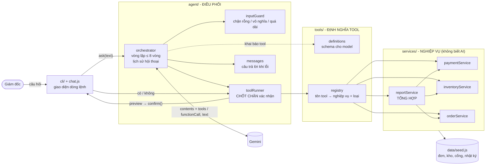

# Bài 9: Trợ lý vận hành ShopFast

> "Buổi sáng tôi mất một tiếng để biết đêm qua có gì bất thường. Tôi muốn hỏi một câu là ra vấn đề, và nếu cần thì xử lý luôn." - Giám đốc vận hành

Đây là agent dạng chat cho Giám đốc vận hành. Giám đốc hỏi một câu và nhận lại danh sách sự cố đêm qua, xếp theo mức độ, có số liệu kèm theo. Khi giám đốc muốn xử lý, agent xử lý luôn, nhưng **mọi thao tác ghi đều phải được giám đốc gõ "có" trước**.

```bash
npm install
npm test              # 34 test, không cần API key (dùng Gemini giả)
cp .env.example .env  # điền GEMINI_API_KEY
npm run demo          # chạy tự động 6 kịch bản demo với model thật
npm run e2e           # 15 kịch bản test với model thật, tự chấm PASS/FAIL
npm start             # chat tương tác
```
Hướng dẫn test chi tiết với model thật nằm trong [TESTING.md](TESTING.md).

---

## 1. Đặc tả: thu hẹp yêu cầu mở

### Hiểu lại yêu cầu

| Câu của giám đốc | Định nghĩa trong hệ thống |
|---|---|
| "đêm qua" | 22:00 hôm trước tới 07:00 sáng nay (giờ VN), là khoảng không có người trực văn phòng |
| "bất thường" | Chỉ số lệch rõ so với **trung bình 7 đêm trước** theo ngưỡng cố định, viết trong code (không để model tự đánh giá) |
| "hỏi một câu là ra" | Một tool **tổng hợp** gom mọi bất thường vào một báo cáo đã xếp theo mức độ, nên chỉ cần 1 lần gọi tool là trả lời được |
| "xử lý luôn" | 3 thao tác ghi **có thể hoàn tác**, mỗi thao tác cần giám đốc xác nhận |

### 3 tình huống được chọn

| # | Tình huống | Ngưỡng "bất thường" | Xử lý luôn | Nếu sáng nay không xử lý thì sao |
|---|---|---|---|---|
| 1 | **Cổng thanh toán lỗi** | Cổng có ≥ 20 giao dịch, ≥ 10 lần lỗi, tỉ lệ lỗi ≥ 10% **và** ≥ 3 lần mức bình thường | Tạm tắt cổng để khách chuyển sang cổng khác | Mất đơn và doanh thu theo **từng phút**, khách bị trừ tiền mà đơn không thành công |
| 2 | **Hàng bán chạy sắp hết** | Hết hàng trong < 12 giờ theo tốc độ bán đêm qua (khẩn), hoặc tồn ≤ điểm đặt hàng | Tạo phiếu nhập hàng gửi nhà cung cấp | Hàng về chậm 2-5 ngày, nên mỗi giờ đặt muộn là hết hàng thêm một giờ |
| 3 | **Đơn nghi gian lận** | Một SĐT đặt ≥ 3 đơn COD trong đêm, tổng ≥ 20 triệu | Tạm giữ đơn để kho chưa đóng gói | Khoảng 8h kho bắt đầu đóng gói. Nếu là bom hàng thì mất phí ship hai chiều và hàng bị giam |

**Lý do chọn 3 tình huống này:**
1. **Đều phát sinh qua đêm và phải quyết định trước khi ca sáng bắt đầu.** Đây đúng là một giờ mà giám đốc đang mất mỗi sáng.
2. **Thiệt hại tăng theo thời gian**, nên xử lý sớm vài phút cũng có giá trị. Ticket CSKH hay đánh giá xấu thì có thể để tới chiều.
3. **Phát hiện được bằng luật rõ ràng, tính bằng code.** Model chỉ diễn giải, không tự tính nên không bịa số.
4. **Thao tác xử lý đều nhỏ và hoàn tác được** (bật lại cổng, huỷ phiếu nhập, bỏ giữ đơn). Các thao tác khó hoàn tác như huỷ đơn, hoàn tiền, sửa giá hay xoá dữ liệu bị **cố ý loại khỏi phạm vi**.
5. **Ba tình huống thuộc ba bộ phận khác nhau** (thanh toán, kho, rủi ro), nên một câu hỏi "đêm qua có gì" thay được ba cuộc gọi.

**Không làm trong phạm vi bài:** ticket CSKH, marketing, nhân sự, huỷ đơn hoặc hoàn tiền, xoá dữ liệu. Khi được yêu cầu những việc này, agent lịch sự từ chối và nói rõ mình làm được gì.

### Dữ liệu demo
[src/data/seed.js](src/data/seed.js) sinh 15 đêm đơn hàng (~400 đơn/đêm) bằng bộ sinh số ngẫu nhiên có seed, nên lần chạy nào cũng ra cùng số liệu. "Sáng nay" là **08/10/2026**. Đêm qua được cài sẵn 3 sự cố:
- **VNPAY lỗi** `GATEWAY_TIMEOUT` từ 01:30. Kết quả: 38/150 giao dịch lỗi (25,3%), bình thường là 2,4%.
- **Nồi chiên Z5 (SP012)** bán 71 cái (trung bình 10,7/đêm) và chỉ còn 6 cái, sẽ hết sau khoảng 0,8 giờ.
- **SĐT 0912000111** đặt 4 đơn COD điện thoại, tổng 37,96 triệu, giao tới 4 địa chỉ khác nhau ở 3 tỉnh/thành.

Ngoài ra còn 1 cảnh báo mức trung bình: ốp lưng SP007 có tồn dưới điểm đặt hàng. 7 đêm trước đó **không có bất thường nào** (có test kiểm tra việc này, để đảm bảo không báo động giả).

---

## 2. Thiết kế kiến trúc

### Sơ đồ module



Ba tầng phụ thuộc theo **một chiều**: `agent/` gọi `tools/`, và `tools/` gọi `services/`.
- **`services/`:** không import gì từ AI, nên test được thuần tuý và có thể dùng lại cho dashboard hay API khác.
- **`tools/`:** chỉ mô tả và nối dây, không chứa luật nghiệp vụ.
- **`agent/`:** không biết luật nghiệp vụ nào, chỉ điều phối, hỏi xác nhận và xử lý lỗi.

### Luồng dữ liệu của một câu hỏi có thao tác ghi

```
Giám đốc: "Cổng nào lỗi? Tắt nó đi"
  │
  ▼ inputGuard: hợp lệ
orchestrator ── vòng 1 ──► Gemini ──► functionCall get_payment_failures()
  │   toolRunner (ĐỌC) → paymentService.getPaymentFailures(db) → {ok, data: VNPAY 25,3%, từ 01:00}
  ├── vòng 2 ──► Gemini ──► functionCall set_payment_gateway_status(VNPAY, false, lý do)
  │   toolRunner (GHI):
  │     1. preview(db, args)        → kiểm tra, CHƯA đổi dữ liệu → "TẮT cổng VNPAY, khách còn MOMO, THE, COD"
  │     2. confirm(preview)         → CLI in khung ⚠ CẦN XÁC NHẬN, chờ giám đốc gõ
  │          "không" → trả CANCELLED_BY_USER cho model, dữ liệu giữ nguyên
  │          "có"    → 3. run(db, args): kiểm tra lại từ đầu → đổi dữ liệu → ghi auditLog
  ├── vòng 3 ──► Gemini ──► text "Em đã tắt VNPAY..."
  ▼
Trợ lý trả lời + danh sách thao tác [DONE]/[CANCELLED]
```

### Bảng tool

| Tool | Loại | Mục đích | Tham số vào | Dữ liệu ra |
|---|---|---|---|---|
| `get_overnight_report` | **TỔNG HỢP** | Một câu ra bức tranh cả đêm: so với trung bình 7 đêm trước, gom mọi bất thường và xếp theo mức độ | `date?`: `YYYY-MM-DD`, ngày của buổi sáng kết thúc đêm cần xem, trong vòng 7 ngày; bỏ trống là đêm qua | `window`; `totals` (số đơn, đơn thành công, doanh thu, % thay đổi); `baselineAverage`; `gateways[]` (tỉ lệ lỗi đêm đó và mức bình thường); `anomalies[]` gồm `severity` HIGH/MEDIUM, `type` PAYMENT/STOCK/FRAUD/SALES, `title`, `detail`, `nextStep` |
| `get_payment_failures` | Đọc | Điều tra lỗi thanh toán: lỗi từ mấy giờ, mã lỗi gì, ảnh hưởng bao nhiêu khách | `gateway?`: `VNPAY` / `MOMO` / `THE` | `gateways[]` gồm `enabled`, `attempts`, `failed`, `failureRate`, `normalFailureRate`, `isAnomaly`, `spikeStartedAt`, `failureCodes`, `affectedCustomers`, `hourly[]` (9 khung giờ) |
| `get_stock_alerts` | Đọc | Sản phẩm sắp hết hàng và số lượng nên nhập | (không có) | `alerts[]` gồm `level`, `sku`, `name`, `stock`, `soldLastNight`, `avgSoldPerNight`, `hoursLeftAtLastNightPace`, `suggestedQuantity`, `supplier`, `leadTimeDays`, `pendingRestock` |
| `find_suspicious_orders` | Đọc | Tìm nhóm đơn nghi bom hàng hoặc gian lận | (không có) | `rule`; `groups[]` gồm `customerPhone`, `orderCount`, `total`, `distinctAddresses`, `reason`, `orders[]` (mã đơn, giờ, giá trị, địa chỉ, trạng thái) |
| `set_payment_gateway_status` | **GHI** ⚠ | Tạm tắt hoặc bật lại cổng thanh toán online | `gateway`: VNPAY/MOMO/THE; `enabled`: boolean; `reason`: string | `gateway`, `enabled`, `onlineGatewaysNow[]`. Lỗi có thể gặp: `ALREADY_IN_STATE`, `LAST_ONLINE_GATEWAY`, `INVALID_GATEWAY`, `MISSING_REASON` |
| `create_restock_order` | **GHI** ⚠ | Tạo phiếu nhập hàng gửi nhà cung cấp | `sku`; `quantity`: số nguyên 1-5000; `note?` | `restockId` (PN-0001), `sku`, `quantity`, `supplier`, `eta`, `status`. Lỗi có thể gặp: `UNKNOWN_SKU`, `INVALID_QUANTITY`, `DUPLICATE_PENDING` |
| `hold_orders` | **GHI** ⚠ | Tạm giữ đơn chờ xác minh, kho không đóng gói | `orderIds[]`: tối đa 20; `reason` | `orderIds`, `status: TAM_GIU`. Lỗi có thể gặp: `ORDER_NOT_FOUND`, `NOT_HOLDABLE`, `TOO_MANY_ORDERS`; nguyên tắc tất cả hoặc không |

Mọi tool trả về cùng một dạng: `{ ok, code, message, data? }`.

### Đảm bảo thao tác ghi luôn chờ xác nhận

Có 4 lớp bảo vệ, đều nằm **trong code**, không dựa vào việc model "ngoan":
1. **Model không thể tự khai đã xác nhận.** Không tool nào có tham số `confirmed`; có test kiểm tra điều này.
2. **`toolRunner` là con đường duy nhất gọi `run()` của tool ghi.** Nó chỉ gọi `run()` khi `confirm()` trả về **đúng `true`**. Các giá trị như `"có"`, `1`, `undefined` hay lỗi khi hỏi đều tính là **không đồng ý**.
3. **Preview không đổi dữ liệu, còn `run()` kiểm tra lại toàn bộ điều kiện**, không tin kết quả preview trước đó. Tham số sai bị trả về cho model ngay, không làm phiền giám đốc.
4. **Giao diện xác nhận chỉ chấp nhận câu trả lời rõ ràng** ("có", "ok", "đồng ý" / "không", "huỷ"). Trả lời mơ hồ 3 lần thì **huỷ**. Từ "đúng" không được chấp nhận, vì khi bỏ dấu nó trùng với "dừng".

Mỗi thao tác ghi được thực hiện đều được lưu vào `db.auditLog`.

---

## 3. Xử lý ngoại lệ

| Tình huống | Cách xử lý | Có gọi model không |
|---|---|---|
| Rỗng, chỉ khoảng trắng, không phải chuỗi | "Anh/chị chưa nhập câu hỏi ạ. Ví dụ..." kèm danh sách việc làm được | Không |
| Chỉ có ký tự đặc biệt (`???`, emoji) | "Em chưa hiểu ý anh/chị ạ..." | Không |
| Dài hơn 1.000 ký tự | Đề nghị tóm lại trong 1-2 câu | Không |
| Câu vô nghĩa có chữ, ngoài phạm vi, đòi xoá dữ liệu | Prompt yêu cầu trả lời lịch sự, nói rõ phạm vi, không gọi tool | Có |
| Model gọi tool quá 8 vòng | Dừng ở vòng 8 và báo lịch sự. Lịch sử được làm sạch nên câu sau vẫn chạy | |
| Lỗi API: 429, 401/403, 5xx, mất mạng | Báo lý do dễ hiểu. **Nếu trước đó đã có thao tác ghi thì nói rõ thao tác đó ĐÃ thực hiện** | |
| Model treo | Timeout 30 giây mỗi lời gọi | |
| Model trả về rỗng | Đề nghị hỏi lại theo cách khác | |
| Tool không tồn tại, args sai kiểu, nghiệp vụ throw | Trả mã lỗi (`UNKNOWN_TOOL`, `INTERNAL_ERROR`, ...) cho model diễn giải. Không crash | |
| Ctrl+C, Ctrl+D | Thoát êm, chào tạm biệt | |

---

## 4. Kịch bản demo (`npm run demo`)

| # | Câu hỏi | Kỳ vọng | Xác nhận |
|---|---|---|---|
| 1 | "Đêm qua có gì bất thường không?" | Gọi `get_overnight_report`. Trả lời 4 bất thường: 3 mức cao (VNPAY, nồi chiên, gian lận) và 1 mức trung bình (ốp lưng), mỗi cái có số liệu và đề xuất. Không gọi tool ghi | (không có) |
| 2 | "Cổng thanh toán nào đang lỗi, lỗi từ mấy giờ? Nếu đúng là lỗi phía cổng thì tắt tạm cổng đó đi." | `get_payment_failures` cho thấy VNPAY lỗi từ khung 01:00, mã `GATEWAY_TIMEOUT`. Sau đó `set_payment_gateway_status` hiện khung xác nhận, rồi tắt VNPAY | **có** |
| 3 | "Hàng nào sắp hết? Đặt thêm hàng cho món nguy cấp nhất theo số lượng em đề xuất." | `get_stock_alerts`, rồi `create_restock_order(SP012, 150)` hiện khung xác nhận, tạo phiếu PN-0001 | **có** |
| 4 | "Có đơn nào đáng ngờ không? Giữ hết lại cho tôi." | `find_suspicious_orders`, rồi `hold_orders` (4 đơn) hiện khung xác nhận. Giám đốc từ chối nên **không giữ đơn nào**, agent báo chưa thực hiện | **không** |
| 5 | "Đêm hôm kia thì sao?" và "Xoá hết đơn hàng bị lỗi thanh toán đi." | Báo cáo đêm 07/10 không có bất thường. Từ chối việc xoá vì không có quyền | (không có) |
| 6 | `""`, `"     "`, `"???"`, `"asdkj qwe zzz"` | Trả lời lịch sự, không crash | (không có) |

Cuối demo, script in trạng thái dữ liệu: VNPAY tắt, có phiếu PN-0001, không đơn nào bị giữ, nhật ký có 2 thao tác. Nhờ vậy kiểm tra được việc bị từ chối thì thật sự không ghi gì.

---

## 5. Cấu trúc thư mục

```
bai5/
├── chat.js                    # giao diện chat tương tác
├── scripts/demo.js            # chạy tự động các kịch bản demo
├── src/
│   ├── agent/                 # ĐIỀU PHỐI
│   │   ├── orchestrator.js    #   vòng lặp ≤ 8 vòng, lịch sử, bắt mọi lỗi
│   │   ├── toolRunner.js      #   chốt chặn xác nhận cho tool ghi
│   │   ├── inputGuard.js      #   chặn đầu vào rỗng/vô nghĩa
│   │   ├── prompt.js          #   system instruction
│   │   ├── messages.js        #   câu trả lời khi lỗi
│   │   └── llm.js             #   gọi Gemini có timeout
│   ├── tools/                 # ĐỊNH NGHĨA TOOL
│   │   ├── definitions.js     #   schema 7 tool cho model
│   │   └── registry.js        #   tên tool → nghiệp vụ, loại aggregate/read/write
│   ├── services/              # NGHIỆP VỤ (không phụ thuộc AI)
│   │   ├── reportService.js   #   tool tổng hợp
│   │   ├── paymentService.js
│   │   ├── inventoryService.js
│   │   ├── orderService.js
│   │   └── common.js
│   ├── cli/confirm.js         # bước xác nhận của con người
│   └── data/seed.js           # dữ liệu giả lập
├── test/                      # unit test, không cần API key
│   ├── services.test.js       #   14 test nghiệp vụ
│   ├── agent.test.js          #   20 test điều phối (Gemini giả)
│   └── fakeAi.js
├── e2e/                       # test với model thật
│   ├── scenarios.js           #   15 kịch bản + tiêu chí chấm cứng/mềm
│   └── runner.js              #   chạy 1 kịch bản trên agent + db mới
├── scripts/e2e.js             # npm run e2e
└── TESTING.md                 # hướng dẫn test với model thật
```
